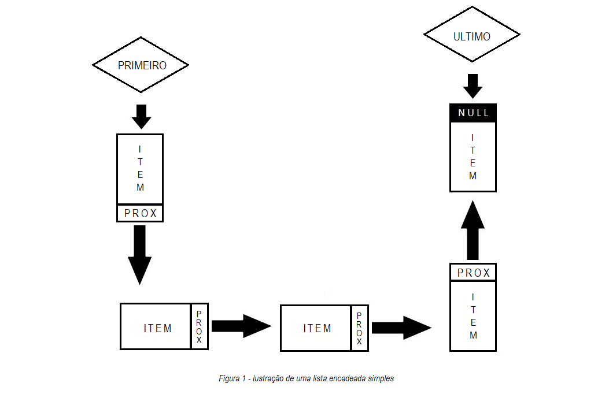

# <b>AEDS: Funções com Lista</b>
<h3>Problemática</h3>

Crie uma lista que consiga armazenar um conjunto de 100 nomes quaisquer, os quais serão salvos de forma aleatória. Feito a estrutura conduza as seguintes ações: 

	<ul>
		<li>
			
Uma função que consiga identificar replicações na lista, ou seja, nomes iguais. Remova
todas as réplicas sem mover os ”ponteiro“.
</li><li>
Como você gerenciaria os espaços em branco para novas inserções? Qual seria o custo
dessas novas inserções?

		</li>
	</ul>

<h3>Solução</h3>

Tendo em vista a problemática, a estrutura selecionada para sua resolução foi a lista encadeada simples. Contextualizando, uma lista encadeada simples é uma sequência de células; cada célula contém um objeto (todos os objetos são do mesmo tipo) e o endereço da célula seguinte.  Nesse contexto, é empregado o Item nas células sendo que cada objeto é um registro que pode ser definido assim:
 

	<code><pre>Class Item{
	string value;
	Item *prox;
};</pre></code>

 

Para exemplificar a implementação de listas encadeadas simples, vamos considerar Figura 1. Nela é possivel observar a representação do algoritimo, no qual é necessário armazenar o endereço de início e fim para que ela nao desapareça durante o processamento. 
  

Visto isso, após contruir todas essas estruturas, resta apenas implementar uma função que seja capaz de verificar Itens repetidos dentro da lista. Nessa conjuntura, é importante enfatizar que um item pode ou nao possir valor, desse modo torna-se facil efeturar a "exclusão" dos itens duplicados no sistema. Assim sendo, para expor um Item vazio basta categorizar um valor especial que o identifique como tal. Este projeto utiliza da seguinte estrutura para isso:

	<code><pre>Item::Item(){
	this->value = "";
};</pre></code>

 

Com isso, o software identifica objetos repetidos no interior da lista e os torna vazios.

Por fim, para atender o quesito de  remover todas as réplicas sem mover os ”ponteiro“, basta desconsiderar os elementos vazios durante a apresentação da lista ao usuário.

Tecnologia: C++

<b>Feito por Luan Gonçalves Santos
<b>

